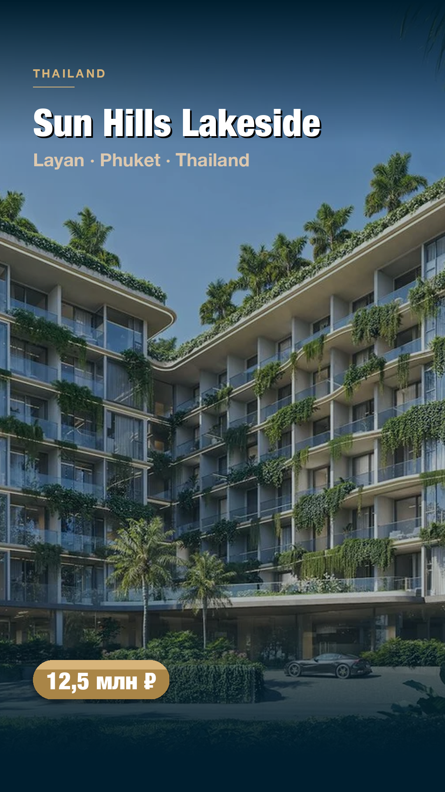
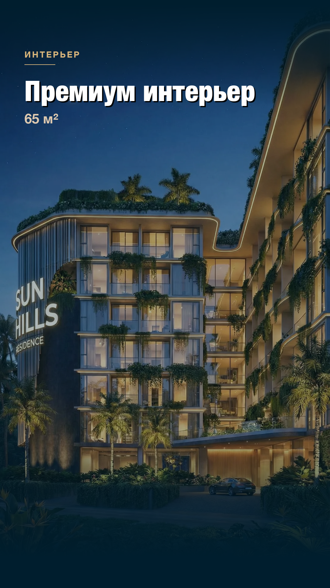
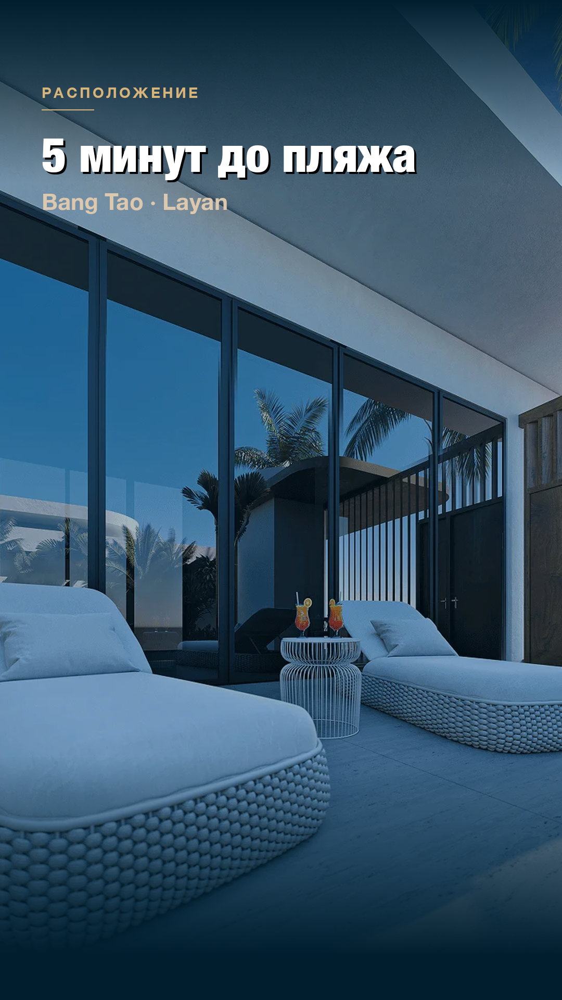
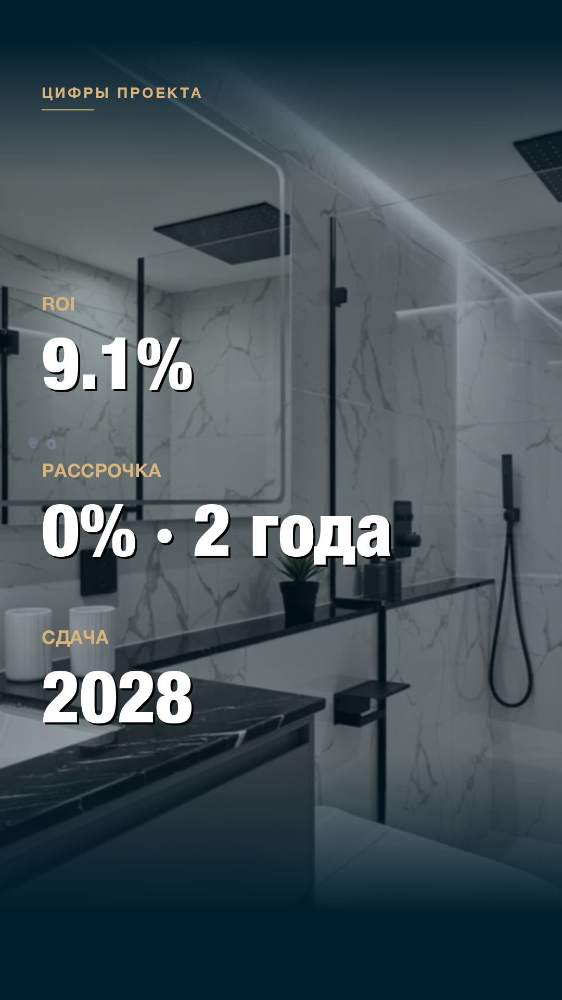
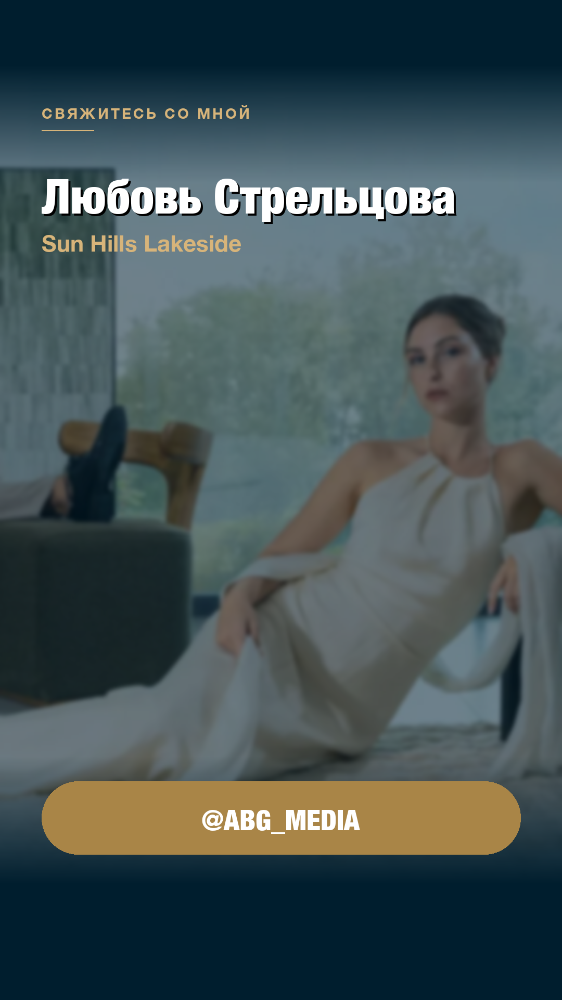

<div align="center">

<p>
  <a href="https://github.com/SergeyKrin9/broker-reels/stargazers"></a>
  <a href="https://github.com/SergeyKrin9/broker-reels/blob/main/LICENSE"></a>
  
  
  
</p>

<sub>🐍 Python · 🎬 9:16 MP4 · 🧠 LLM-driven captions · ⚡ 30-60 sec per video · 🤖 End-to-end</sub>

</div>

> [!IMPORTANT]
> **Real production tool.** Used at [B8 Estate](https://b8estate.com) to generate Reels for broker units automatically. Replaces an SMM specialist for content production. See [`demo_output.mp4`](./demo_output.mp4) for an example output.

Python pipeline that turns a real estate listing into a TikTok/Reels-style 9:16 MP4 — captions, price/ROI badges, Ken Burns motion. **End-to-end automation:** broker picks a unit → 30-60 seconds → finished MP4 ready to publish.

### 🎥 See the result

[**📺 demo_output.mp4**](./demo_output.mp4) — click to download/play (3.3 MB, 9:16, 30 sec)

Five generated slides (hero, interior, view, ROI, CTA):
<table>
  <tr>
    <td width="20%"></td>
    <td width="20%"></td>
    <td width="20%"></td>
    <td width="20%"></td>
    <td width="20%"></td>
  </tr>
</table>

## What it does

A marketing engineer for small real estate agencies. Instead of hiring an SMM specialist:

1. Broker clicks "generate video" on a listing in the CRM
2. A Cloud Function calls this Python service with `unitId`
3. Service pulls photos + project info from Firestore
4. LLM (NVIDIA Llama 70B) generates a 5-frame script with captions
5. Pillow composes 1080×1920 slides with text overlays, badges, brand styling
6. ffmpeg adds Ken Burns motion + music → MP4
7. Result is uploaded back to Storage, broker gets a preview

**Replaces** the work of an SMM specialist for content production — at scale, on demand.

## Architecture

```
Broker (CRM web app)
  │  POST /api/broker-reel/generate { unitId }
  ▼
Cloud Function (Node.js)
  │  fetches unit + photos + project data
  │  POST → broker_reels HTTP service
  ▼
broker_reels/http_server.py (Flask, on a VPS)
  │
  ├─ firebase_client.py     download photos → /tmp
  ├─ caption_generator.py   NVIDIA Llama → 5-frame script JSON
  ├─ reel_composer.py       PIL slides (photo + caption + price-badge)
  ├─ video_composer (reuse) ffmpeg Ken Burns + music → MP4
  └─ firebase_client.py     upload MP4 to Storage
  │
  ▼  callback POST → Cloud Function `brokerReelCompleted`
  │  writes { reelUrl, reelGeneratedAt } to Firestore
  ▼
Broker sees preview + [Download / Telegram / Regenerate] buttons
```

## Files

| File | Purpose |
|---|---|
| `reel_composer.py` | PIL 1080×1920 slides with real-estate templates |
| `caption_generator.py` | NVIDIA Llama → captions JSON |
| `firebase_client.py` | Download photos / upload MP4 via Firebase Admin SDK |
| `orchestrator.py` | End-to-end: photos + unit data → MP4 |
| `http_server.py` | Flask endpoint for the Cloud Function webhook |
| `templates/` | Design tokens — colors, fonts, badge templates |
| `demo_photos/` | Sample photos for local smoke test |
| `demo_output.mp4` | A real generated reel — open to see the output |

## Five-frame template

| # | Frame | Shows | Caption example |
|---|---|---|---|
| 1 | **Hero** | Main complex/villa photo | Project name + price badge |
| 2 | **Interior** | Inside shot | "Premium interior · 65 m²" |
| 3 | **View** | Window / location | "5 min from the beach" |
| 4 | **ROI** | Numbers | "ROI 9.1% · 0% installment" |
| 5 | **CTA** | Broker contact | Broker name + handle |

## Design language

"Warm precision luxury" — navy `#003D55` / jade `#1E5C5E` / gold `#A98547` / ivory `#FBF7F1`.
Fonts: Montserrat / Cinzel with safe fallbacks.
Animation: subtle Ken Burns (1.0 → 1.05), text fade-in, badge zoom-in.

## Local smoke test (no Firebase needed)

```bash
cd broker-reels
pip install -r requirements.txt
python3 orchestrator.py --demo   # uses demo_photos/ + hardcoded captions → demo_output.mp4
```

## Tech stack

- **Python 3.10+** · Pillow · Flask · requests
- **firebase-admin** SDK (Storage + Firestore)
- **ffmpeg 8.x** for video composition
- **NVIDIA NIM** (Llama 3.3 70B) for caption generation

## Deployment

- Local: development & smoke test
- Production: systemd service on a VPS, Flask on port 5000
- Trigger: HTTPS Cloud Function from the CRM

## Roadmap

- v1.1: voice clone via ElevenLabs (~$5/mo)
- v1.2: FLUX.1-Depth/Canny to generate missing frames from floor plans
- v1.3: 4 visual presets (morning, sunset, investor, family)
- v1.4: broker watermark + avatar
- v1.5: auto-publish to broker's Telegram channel from CRM
- v1.6: curated cinematic music library (Bensound / Pixabay / Epidemic)

---

## ⭐ Star history

<a href="https://www.star-history.com/#SergeyKrin9/broker-reels&Date">
  
</a>

## 📚 Related work

- **[agnis-workflow](https://github.com/SergeyKrin9/agnis-workflow)** — the methodology that ships projects like this in 2-3 days instead of 2-3 weeks
- **[mcp-servers](https://github.com/SergeyKrin9/mcp-servers)** — the marketing/ops MCP toolkit used to publish Reels to Telegram and VK from the broker dashboard
- **[portfolio](https://github.com/SergeyKrin9/portfolio)** — the personal site that ships from this same workflow

---

<div align="center">

**Author:** [Sergey Krinitsyn](https://putksebe.su/cv) · sergeykrin98@gmail.com · [GitHub](https://github.com/SergeyKrin9)

<sub>If this saved you the cost of an SMM specialist — drop a ⭐.</sub>

</div>
